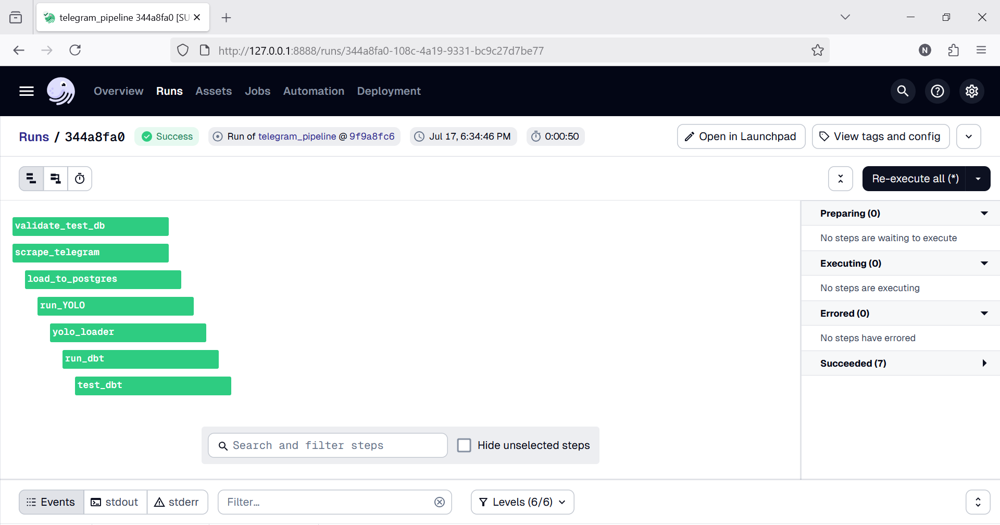
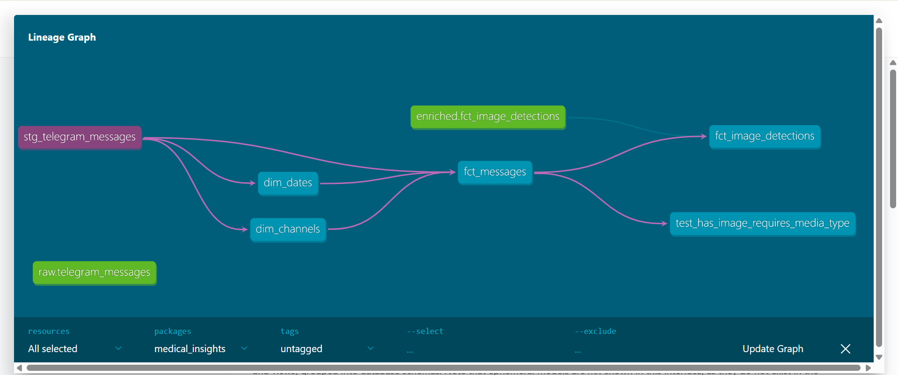
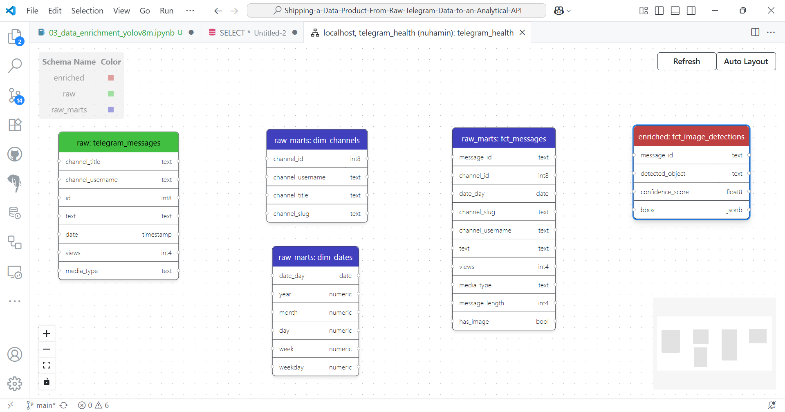
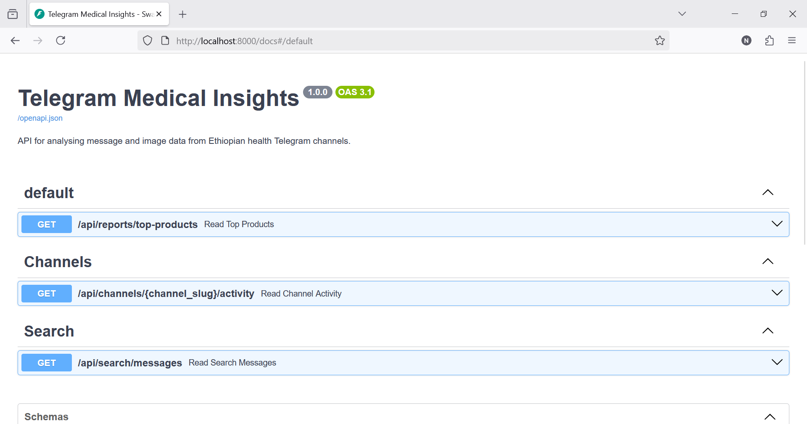
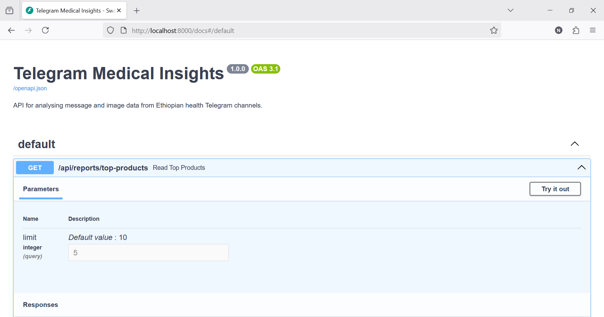
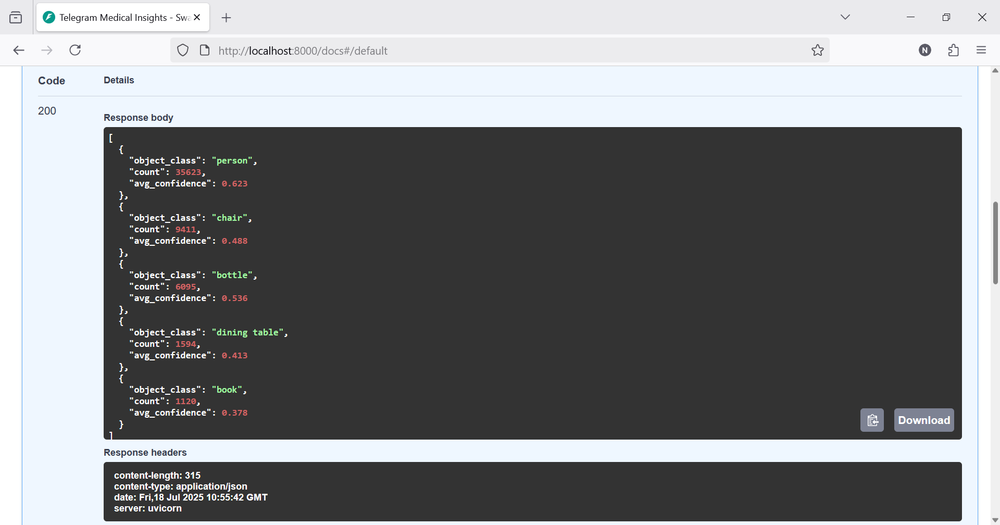
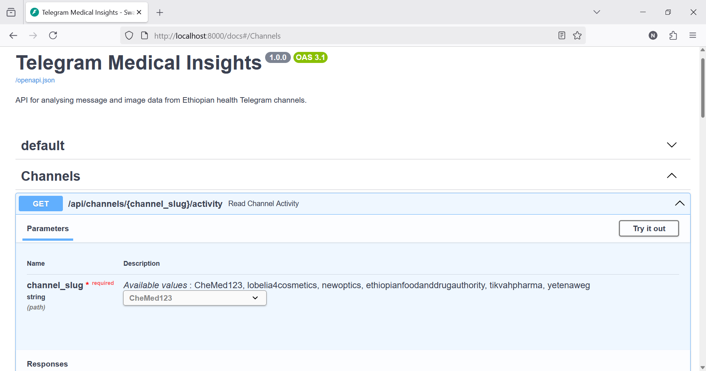
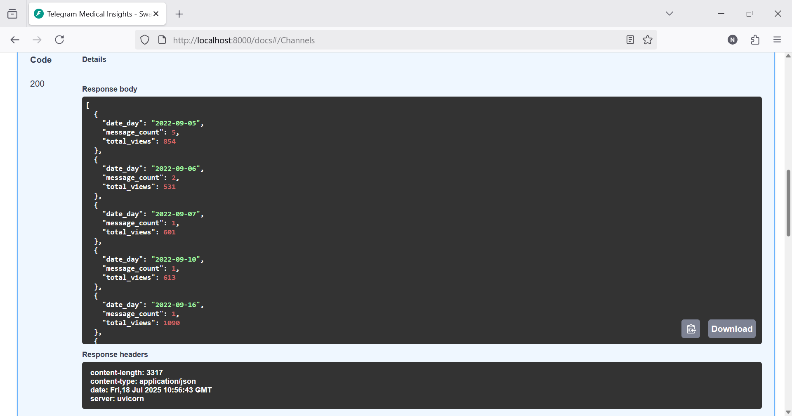
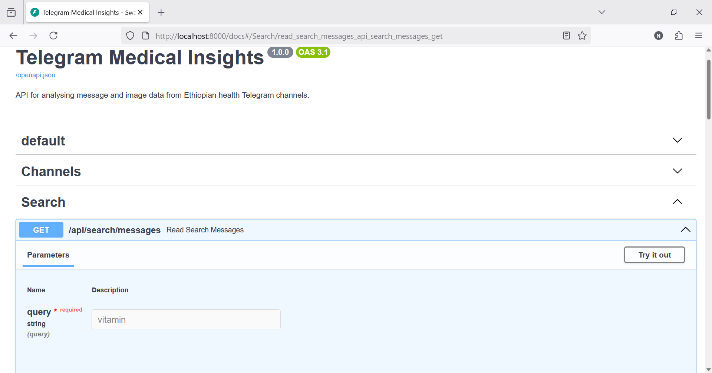
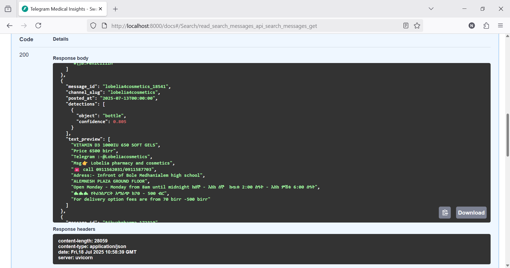

# Shipping a Data Product From Raw Telegram Data to an Analytical API

[](https://github.com/nuhaminae/Shipping-a-Data-Product-From-Raw-Telegram-Data-to-an-Analytical-API/actions/workflows/CI.yml)

## Overview
This project builds an analytical data product by extracting Telegram message data from Ethiopian medical channels. The pipeline transforms unstructured JSON into a clean star schema using dbt, enriching it with image tagging via YOLOv8, and ultimately exposing key insights through a FastAPI backend.All components are orchestrated with Dagster for reliability and automation.

---
## Key Features
- Raw Telegram data scraped with Telethon and stored in structured JSON
- PostgreSQL warehouse with dbt-powered modelling
- Star schema with staging, dimensional, and fact models
- Built-in and custom tests for data integrity and business logic
- YOLOv8 enrichment for medical product detection
- Dagster orchestration with daily scheduling
- Dockerized environment and reproducible setup

---
## Table of Contents
- [Project Background](#project-background)
- [Data Sources](#data-sources)
- [Project Structure](#project-structure)
- [Installation](#installation)
- [Usage](#usage)
- [Contribution](#contribution)
- [Project Highlights] (#project-highlights)
- [Project Status](#project-status)

---
## Project Background
Medical products in Ethiopia are recently being promoted through Telegram channels. This project aims to mine structured insights from that stream — such as message activity, product visibility, and channel engagement — by turning raw scraped messages into a fully analytical warehouse.

The challenge focuses on turning unstructured channel data into:
- A reproducible pipeline
- Enriched metrics
- API-ready insights

---
## Data Sources
- Telegram channels related to Ethiopian health and medicine
    - _Examples: `lobelia4cosmetics`, `tikvahpharma`, `Chemed`_
- Scraped message data (text, views, media_type, date, etc.)
- Product images linked to messages for further enrichment via YOLOv8 

---
## Project Structure
    ```
    Shipping-a-Data-Product-From-Raw-Telegram-Data-to-an-Analytical-API/
    ├── .dvc/
    ├── .github/workflows/
    ├── ...
    ├── .televenv/                     # Virtual environment (not committed)
    ├── api/                           # FastAPI service
    ├── dagster                        # Orchestration with job and schedule
    ├── data/                          # Raw and enriched JSON data and images
    │   └── test/                      # Test-mode data lake
    |   ...
    ├── logs/                          # Log files for tracking (gitignored)
    ├── medical_insights/              # dbt project: models, tests, docs
    ├── notebooks/                     # Development notebooks
    ├── plots/                         # Lineage graph, schema diagrams, API screenshots
    |   ...
    ├── scripts/                       # Scraper, loader, enricher scripts
    |   ...
    ├── .gitignore
    ├── .pre-commit-config.yaml        # Pre-commit hooks configuration
    ├── docker-compose.yml             # Docker Compose file for multi-container applications
    ├── Dockerfile                     # Dockerfile for building the application image
    ├── pyproject.toml                 # Black configuration file
    ├── README.md
    ├── requirements-docker.txt        # Docker-specific Python dependencies
    └── requirements.txt               # Python dependencies for the project
    ```

---
## Installation
### Prerequisites

- Python 3.8 or newer (Python 3.12 recommended)
- `pip` (Python package manager)
- [DVC](https://dvc.org/) (for data version control)
- [Git](https://git-scm.com/)
- Docker (optional for containerized PostgreSQL)

### Setup
```bash
# Clone repo
git clone https://github.com/nuhaminae/Shipping-a-Data-Product-From-Raw-Telegram-Data-to-an-Analytical-API
cd Shipping-a-Data-Product-From-Raw-Telegram-Data-to-an-Analytical-API
____________________________________________
# Create virtual environment
python -m venv .env
# On Windows:
.televenv\Scripts\activate
# On Unix/macOS:
source .chatvenv/bin/activate
____________________________________________
# Install dependencies
pip install -r requirements.txt
____________________________________________
# (Optional) Pull DVC data
dvc pull
```

---
## Usage
### Run the ELT Pipeline
```bash
dagster dev  
dagster dev --port 8888         # Opens Dagster UI at http://localhost:8888
```
Ops include:
- `scrape_telegram` → Telethon-based scraper
- `load_to_postgres` → JSON ingestion into test database
- `run_YOLO` → YOLOv8 enrichment from image folder
- `yolo_loader` → Enrichment loader into `enriched.fct_image_detections`
- `run_dbt`, `test_dbt` → Transformations and tests




---
### Explore Models with dbt

```bash
# Build models with dbt
dbt build
____________________________________________
# Run integrity tests
dbt test
____________________________________________
# Generate docs and view lineage graph
dbt docs generate
dbt docs serve  # Access docs at http://localhost:8080
```
[dbt docs](http://localhost:8080/#!/overview/medical_insights)

- Lineage Graph


- Star Schema Diagram


---
### API Interface (FastAPI)

``` bash
uvicorn api.main:app   
uvicorn api.main:app --reload --port 8000            #Open docs at http://localhost:8000/docs
```
Key endpoints:
- Fast API Endpoints


- `/api/reports/top-products`: _“top 5 most frequently mentioned products”_


- `/api/channels/{channel_slug}/activity`: _"posting activity for ‘CheMed123’ channel"_


- `/api/search/messages?query=...`: _“messages containing keyword ‘vitamin’”_



---
## Scheduling with Dagster

```python
daily_schedule = ScheduleDefinition(
    job=telegram_pipeline,
    cron_schedule="0 7 * * *",  # 7AM daily
    execution_timezone="Africa/Addis_Ababa"
)
```
Registered in Dagster via `defs.py` and visible under the **Schedules** tab.

---
## Contribution
Contributions are welcome! Please fork the repository and submit a pull request. For major changes, open an issue first to discuss what you would like to change.

Make sure to follow best practices for version control, testing, and documentation.

---
## Project Highlights

- Structured a reliable data lake with partitioned raw JSON
- Built a star schema (`dim_channels`, `dim_dates`, `fct_messages`)
- Enriched image content using YOLOv8 and linked via `message_id`
- Implemented dbt tests:
  - `not_null`, `unique`
  - Custom: `has_image → media_type must not be null`
- Exposed insights via API with Pydantic validation
- Orchestrated the full flow with Dagster and daily scheduler

---
## Project Status
Final submission merged. Checkout the commit history [here](https://github.com/nuhaminae/Shipping-a-Data-Product-From-Raw-Telegram-Data-to-an-Analytical-API/commits?author=nuhaminae). 
